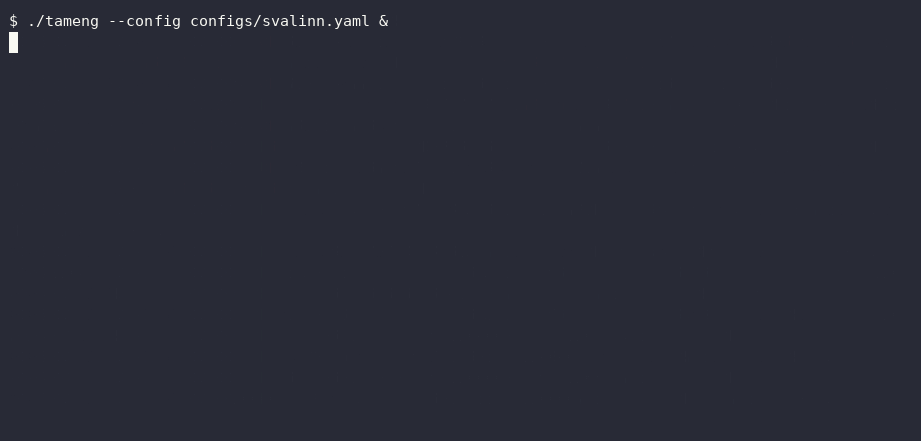
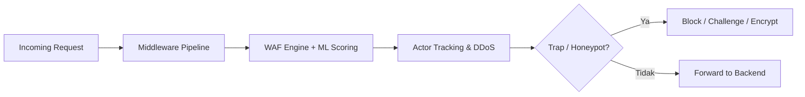
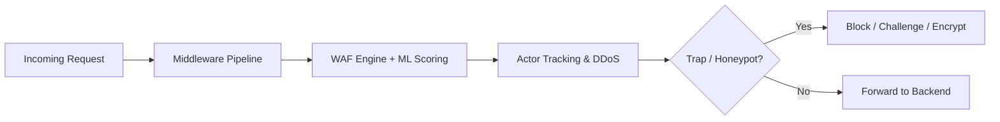

<p align="center">
  
  
  
  
  <a href="https://github.com/koodoxz/tameng/actions"></a>
</p>

<h1 align="center">🛡️ Tameng</h1>

<p align="center">
  <b>A single-binary, ML-assisted Web Application Firewall, written in Go.</b><br>
  <sub>No Python sidecar. No external inference service. No 12-container stack. One binary, one YAML file, one systemd unit.</sub>
</p>

<p align="center">
  🇮🇩 Designed and built in Indonesia, by a solo security engineer, in the open.
</p>

<p align="center">
  
</p>

<p align="center">
  <a href="#bahasa-indonesia">Bahasa Indonesia</a> ·
  <a href="#english">English</a> ·
  <a href="#quick-start-en">Quick Start</a> ·
  <a href="CONTRIBUTING.md">Contributing</a> ·
  <a href="#license">License</a>
</p>

---

# Bahasa Indonesia

## Daftar Isi

- [Tentang Tameng](#tentang-tameng)
- [Kenapa Tameng Berbeda](#differensiator-teknis)
- [Fitur Keamanan Inti](#fitur-keamanan-inti)
- [Mulai Cepat](#mulai-cepat)
- [Konfigurasi](#konfigurasi)
- [Endpoint API](#endpoint-api)
- [Arsitektur](#arsitektur)
- [Testing](#testing)
- [Keamanan & Pelaporan Kerentanan](#keamanan--pelaporan-kerentanan)
- [Roadmap](#roadmap)
- [Berkontribusi](#berkontribusi)
- [Tentang Pembuat](#tentang-pembuat)
- [Lisensi](#lisensi)

## Tentang Tameng 🛡️

**Perisai Web Application Firewall dengan Deteksi Ancaman Bertenaga ML**

Tameng adalah Web Application Firewall (WAF) berkinerja tinggi dengan deteksi ancaman berbasis machine learning, ditulis dalam Go untuk keamanan memori dan performa yang luar biasa.

Tameng menawarkan perlindungan lapisan aplikasi yang komprehensif melalui satu biner Go tunggal, satu file YAML, dan satu layanan systemd — tanpa ketergantungan sidecar eksternal.

### Kenapa "Tameng"?

**Tameng** adalah kata bahasa Indonesia untuk *perisai* — alat pelindung yang berdiri di depan, menahan serangan sebelum mencapai apa yang dilindunginya. Nama ini dipilih dengan sengaja: proyek ini dibangun oleh seorang developer Indonesia, dan harapannya sederhana — menjadi salah satu perisai nyata untuk infrastruktur digital, mulai dari yang dibangun sendiri, lalu siapa pun yang membutuhkannya. Bukan sekadar nama produk, tapi cita-cita: keamanan siber berkualitas yang lahir dan tumbuh dari Indonesia, dibuka untuk semua orang.

> **Catatan Penamaan:** Nama internal (module Go, binary, komentar kode) tetap menggunakan "Svalinn" (nama penutup dalam mitologi Nordik yang melindungi matahari dari kehancuran) — kebetulan bertema sama: perisai. Ini adalah keputusan deliberate untuk menghindari refactoring invasif pada sistem produksi aktif. Dokumentasi publik dan branding menggunakan "Tameng".

## Differensiator Teknis

Dibandingkan dengan WAF open-source lainnya seperti **Coraza** (library WAF murni, kompatibel ModSecurity):

- **Baterai Lengkap:** Satu biner menggabungkan mesin WAF + penilaian ML + pelacakan aktor dua-tahap + eskalasi DDoS 3-fase + lapisan honeypot/deception + integrasi threat intelligence (STIX/TAXII) + pemetaan MITRE ATT&CK
- **Keamanan Regex:** Engine WAF menggunakan RE2 Go (bukan Oniguruma/PCRE) — ReDoS (regex backtracking bencana) mustahil secara struktural, bukan hanya mitigated
- **ML Asli:** Inferensi model berbasis LightGBM berjalan asli dalam Go (via library `leaves`) — tidak ada proses Python sidecar di runtime
- **Tracking Aktor:** Melacak aktor dalam dua tahap (lightweight counters → full profiles) dengan eviction LRU aman memori, bahkan di bawah beban korban DDoS
- **Transparansi Pengujian Adversarial:** Historik pengujian mendalam dengan alat pembuat serangan khusus (dibuat oleh penulis yang sama). Kami mempublikasikan eksperimen yang gagal juga — kebanyakan security tools tidak pernah mengumumkan ketika sebuah pendekatan tidak membantu.

### Adversarial Red-Teaming (Ratatoskr) ⚡

Tameng diuji secara internal menggunakan **Ratatoskr** — tool pembuat serangan/payload generator khusus yang dirancang untuk menguji batas fungsionalitas WAF di bawah beban kerja ekstrem (*high-load*). Telemetry, memory limits, dan blocking rates kami murni berasal dari simulasi red-team riil ini.

| | Tameng | Coraza (library WAF) |
|---|---|---|
| Deployment | 1 biner, 1 config | Library, perlu diintegrasikan ke proxy/app |
| ML threat scoring | Native Go (LightGBM), opsional | Tidak ada |
| Actor/IP reputation tracking | Bawaan, dua-tahap | Tidak ada (stateless per-request) |
| DDoS escalation | Bawaan, 3-fase | Tidak ada |
| Honeypot/deception | Bawaan, 100+ trap | Tidak ada |
| Ruleset | Signature custom, 200+ pattern | OWASP CoreRuleSet (kompatibel ModSecurity) |
| Dependency runtime | Tidak ada (single binary) | Tergantung integrasi |

## Fitur Keamanan Inti

| Fitur | Deskripsi |
|-------|-----------|
| **Mesin WAF (200+ signature)** | SQL Injection, XSS, Path Traversal, Command Injection, SSRF, Log4Shell, Scanner/Bot detection |
| **Proteksi DDoS** | Deteksi EWMA + eskalasi 3-fase (Challenge → Throttle → Block) |
| **Pelacakan Aktor** | Dua-tahap dengan fingerprinting behavioral DNA, penyimpanan memory-safe, integrasi Reserse |
| **Deception Layer** | 100+ honeypot/canary traps untuk mengalihkan dan mengidentifikasi penyerang |
| **Fingerprinting** | JA3 TLS + HTTP behavior profiling |
| **Deteksi Kill Chain** | Korelasi serangan multi-tahap, deteksi Command & Control (C2) |
| **Threat Intelligence** | Integrasi STIX/TAXII, pemetaan MITRE ATT&CK, feed IOC |
| **Guard Protokol** | Deteksi request smuggling, GraphQL depth limiting, WebSocket rate limiting |
| **Analisis Behavioral** | Baseline deviation detection, credential stuffing identification, anomaly correlation |

> **Batasan yang jujur kami sampaikan:** blokir reputasi-IP saat ini berdurasi tetap dan berlaku untuk seluruh IP sumber yang terdeteksi — pada jaringan dengan IP keluar bersama (NAT/proxy korporat/CDN), ini bisa berdampak ke pengguna lain di IP yang sama. Durasi dapat diatur lewat konfigurasi. Lihat [Keamanan & Pelaporan Kerentanan](#keamanan--pelaporan-kerentanan) kalau kamu menemukan dampak ini di deploymentmu.

## Mulai Cepat

### Prasyarat

- **Go 1.21+** (build dari sumber)
- **Docker & Docker Compose** (Docker deployment) — tidak perlu Go installed
- **SQLite3** (embedded di binary Go, CGO diperlukan untuk build)

### Opsi 1: Docker (Direkomendasikan)

```bash
# Clone repo
git clone https://github.com/koodoxz/tameng.git
cd tameng

# Copy environment template
cp .env.example .env

# Edit .env dengan nilai Anda (SVALINN_GOD_KEY, SVALINN_API_KEY, dll)
nano .env

# Build dan jalankan
docker-compose up -d

# Periksa health
curl http://localhost:10000/health

# Lihat logs
docker-compose logs -f svalinn
```

**Port default:** `10000` (HTTP), `10443` (HTTPS)

### Opsi 2: Dari Sumber

```bash
# Prerequisites: Go 1.21+ dengan CGO enabled untuk sqlite3

git clone https://github.com/koodoxz/tameng.git
cd tameng
cp .env.example .env
nano .env

CGO_ENABLED=1 go build -o tameng ./cmd/svalinn
./tameng -config configs/svalinn.yaml
```

## Konfigurasi

Semua konfigurasi melalui **environment variables** dan file `configs/svalinn.yaml`. Lihat `.env.example` untuk daftar lengkap.

**Kunci Wajib:**
- `SVALINN_GOD_KEY` — Kunci autentikasi untuk `/api/v9/*` endpoints (admin saja)
- `SVALINN_API_KEY` — Kunci untuk akses programmatic (threat reporting, actor queries)
- `SVALINN_RESERSE_USER` / `SVALINN_RESERSE_PASS` — Kredensial modul tracking aktor lanjutan (Reserse). Server menolak untuk start jika kosong (fail-closed by design).

**Kunci Opsional (Ekosistem MECOB):**
- `ODIN_API_KEY` — Kunci integrasi opsional dengan layanan gateway/DNS internal ekosistem MECOB (belum rilis publik)

**Tuning Lanjutan:**
Threshold WAF/DDoS, batas jumlah aktor di memory, dan toggle fitur (ML scoring, deception, dll) dikonfigurasi langsung lewat `configs/svalinn.yaml` — bukan environment variable. Lihat file tersebut untuk daftar lengkap opsi (WAF, DDoS, ML, deception, SIEM, CVE feeds, TLS, dll).

## Endpoint API

| Endpoint | Metode | Deskripsi |
|----------|--------|-----------|
| `/health` | GET | Health check |
| `/metrics` | GET | Prometheus metrics |
| `/api/v1/stats` | GET | Server statistics |
| `/api/v1/threats` | GET | Recent threats |
| `/api/v1/actors` | GET | Active actors |
| `/api/v1/config` | GET | Current config |
| `/api/v9/reload` | POST | Reload config (God Mode) |
| `/api/v9/block` | POST | Block IP (God Mode) |
| `/reserse/actors` | GET | Reserse actor details (Basic Auth) |
| `/reserse/actors/{id}/timeline` | GET | Timeline event untuk satu profil aktor (Basic Auth) |
| `/reserse/actors/by-ip/{ip}/timeline` | GET | Timeline event berdasarkan IP (Basic Auth) |
| `/reserse/graph` | GET | Actor relationship graph (Basic Auth) |
| `/taxii` | GET | TAXII discovery document |
| `/taxii/collections` | GET | Daftar koleksi TAXII |
| `/taxii/collections/default/objects` | GET | Baca STIX indicator (public) |
| `/taxii/collections/default/objects` | POST | Submit STIX indicator (perlu `SVALINN_API_KEY`) |

## Arsitektur

```
internal/
├── actor/          # Two-stage actor tracking (lightweight → full profiles)
├── behavior/       # Behavioral baseline + deviation analysis
├── collector/      # Threat intelligence collectors
├── config/         # YAML config loader with env expansion
├── countermeasures/ # Active response mechanisms
├── db/             # SQLite persistence
├── ddos/           # EWMA + 3-phase escalation
├── deception/      # Honeypots + canary tokens
├── detect/         # Kill chain + C2 detection
├── ecosystem/      # MECOB ecosystem integration (internal gateway/DNS services)
├── egress/         # Egress filtering
├── fingerprint/    # JA3 + HTTP fingerprinting
├── geoip/          # MaxMind GeoIP lookups
├── hardening/      # Memory + security hardening
├── heuristics/     # Threat scoring heuristics
├── honeypot/       # Dedicated honeypot engine
├── intel/          # MITRE ATT&CK + IOC + STIX
├── logger/         # zerolog structured logging
├── logic/          # Business logic abuse detection
├── malware/        # Malware behavior analysis
├── ml/             # LightGBM ML bridge (native Go)
├── observatory/    # Top actors cache (Hall of Fame)
├── orchestrator/   # Detection orchestration
├── payload/        # YARA/Sigma/Snort signatures
├── preattack/      # Pre-attack detection (recon/scanning)
├── protocol/       # Request smuggling, GraphQL depth, WebSocket
├── response/       # Response encryption + PoW challenges
├── security/       # Security hardening utilities
├── semantic/       # Semantic payload analysis
├── server/         # HTTP/TLS server + middleware pipeline
├── session/        # Session tracking
├── siem/           # SIEM integration
└── waf/            # WAF signature engine (200+)
```



**Data Flow:** Request masuk → middleware pipeline → WAF signature check + ML scoring → actor tracking + behavioral analysis → DDoS detection → deception/honeypot checks → response shaping (encryption, PoW) → SIEM/intel logging → forward to backend (atau block/challenge).

## Testing

```bash
go test ./internal/...                                  # Unit tests
go test -race ./internal/...                             # Dengan race detector
go test -coverprofile=coverage.out ./internal/...        # Coverage
go tool cover -func=coverage.out
go test ./internal/waf/...                                # Specific package
go test -bench=. -benchmem ./internal/...                # Benchmarks
```

Lihat file `*_test.go` untuk differential fuzz tests, mutation tests, dan adversarial test cases.

## Keamanan & Pelaporan Kerentanan

Tameng menjalankan `/.well-known/security.txt` di setiap instance yang jalan (lihat `/security-policy` untuk kebijakan lengkap). Untuk melaporkan kerentanan atau perilaku tak terduga (termasuk dampak dari desain blokir-reputasi-IP di atas), hubungi **koodoxz@gmail.com**. Target respons awal: 24 jam. Triage: 72 jam.

Mohon jangan buka issue publik untuk kerentanan yang belum di-patch — laporkan lewat email dulu.

## Roadmap

- [x] Publikasikan CI build terverifikasi penuh (GitHub Actions, cross-platform)
- [ ] Konfigurasi durasi blokir reputasi-IP per-kategori (bukan durasi tetap tunggal)
- [ ] Dokumentasi deployment reverse-proxy (di depan backend generik)
- [ ] Ekspansi signature WAF untuk kategori LFI/RFI

Punya usulan lain? Buka [issue](.github/ISSUE_TEMPLATE/feature_request.md).

## Berkontribusi

Lihat [CONTRIBUTING.md](CONTRIBUTING.md) untuk panduan lengkap: proses issue/PR, gaya kode Go, running tests.

Secara singkat:
- Fork, branch, commit dengan pesan deskriptif
- Jalankan `go fmt`, `go vet`, `go test -race`
- Coverage minimal 80% untuk kode baru
- Jelaskan perubahan dengan jelas di PR, termasuk implikasi keamanan jika ada

## Tentang Pembuat

Tameng dikembangkan dan dirawat oleh satu orang developer/security engineer asal Indonesia, sebagai proyek open-source pertama yang dirilis ke publik. Dibangun, diuji secara adversarial, dan didokumentasikan secara transparan — termasuk kegagalan-kegagalannya. Kontak: **koodoxz@gmail.com**.

## Lisensi

**AGPL-3.0** — Kode sumber harus tersedia untuk semua pengguna dari versi yang dimodifikasi, **termasuk ketika dijalankan sebagai layanan jaringan** (ini yang membedakan AGPL dari GPL biasa). Provider hosting/cloud tidak dapat mengambil kode ini, memodifikasinya, dan menawarkannya sebagai layanan bersaing tanpa merilis modifikasi mereka. Teks lengkap: [LICENSE](LICENSE).

---

# English

## Table of Contents

- [About Tameng](#about-tameng)
- [Why Tameng Is Different](#technical-differentiation)
- [Core Security Features](#core-security-features)
- [Quick Start](#quick-start-en)
- [Configuration](#configuration)
- [API Endpoints](#api-endpoints)
- [Architecture](#architecture)
- [Testing](#testing-en)
- [Security & Vulnerability Reporting](#security--vulnerability-reporting)
- [Roadmap](#roadmap-en)
- [Contributing](#contributing-en)
- [About the Author](#about-the-author)
- [License](#license)

## About Tameng 🛡️

**Web Application Firewall with ML-Powered Threat Detection**

Tameng is a high-performance Web Application Firewall (WAF) with machine learning-powered threat detection, written in Go for memory safety and exceptional performance.

Tameng delivers comprehensive application-layer protection through a single Go binary, one YAML file, and one systemd service — with no external sidecar dependencies.

### Why "Tameng"?

**Tameng** is the Indonesian word for *shield* — something that stands in front, absorbing an attack before it reaches whatever it protects. The name was chosen deliberately: this project is built by an Indonesian developer, and the hope behind it is simple — to be one real shield for digital infrastructure, starting with what its author builds, then for whoever else needs it. Not just a product name, but an intent: security tooling that's genuinely good, born and grown in Indonesia, and given away to everyone.

> **Naming Note:** The internal codebase (Go module path, binary name, code comments) still uses the codename "Svalinn" (the shield in Norse mythology that protects the sun from destruction) — fittingly, the same theme. This is a deliberate choice to avoid invasive refactoring on a live production system. Public documentation and branding use "Tameng."

## Technical Differentiation

Compared to other open-source WAFs like **Coraza** (a pure WAF library, ModSecurity-compatible):

- **Batteries Included:** One binary combines WAF signature engine + ML threat scoring + two-stage actor tracking + 3-phase DDoS escalation (Challenge → Throttle → Block) + honeypot/deception layer + STIX/TAXII threat intelligence + MITRE ATT&CK mapping
- **Regex Safety:** WAF engine uses Go's RE2 regex engine (not Oniguruma/PCRE) — ReDoS (catastrophic backtracking) is structurally impossible, not just mitigated
- **Native ML:** LightGBM model inference runs natively in Go (via the `leaves` library) — no Python sidecar process required at runtime
- **Actor Tracking:** Tracks threat actors in two stages (lightweight counters → full behavioral profiles) with memory-safe LRU eviction, even under DDoS victim load
- **Adversarial Testing Transparency:** Deep red-team history with a purpose-built companion attack tool. We publish failed optimization attempts too — most security tools never announce when an approach didn't help.

### Adversarial Red-Teaming (Ratatoskr) ⚡

Tameng is tested internally using **Ratatoskr** — a custom payload generator and attack simulation tool built to stress-test WAF functional boundaries under high load. Our telemetry, memory limits, and blocking rates stem directly from these real-world red-team simulations.

| | Tameng | Coraza (WAF library) |
|---|---|---|
| Deployment | 1 binary, 1 config file | Library, needs integration into a proxy/app |
| ML threat scoring | Native Go (LightGBM), optional | None |
| Actor/IP reputation tracking | Built-in, two-stage | None (stateless per-request) |
| DDoS escalation | Built-in, 3-phase | None |
| Honeypot/deception | Built-in, 100+ traps | None |
| Ruleset | Custom signatures, 200+ patterns | OWASP CoreRuleSet (ModSecurity-compatible) |
| Runtime dependencies | None (single binary) | Depends on integration |

## Core Security Features

| Feature | Description |
|---------|-------------|
| **WAF Signatures (200+)** | SQL Injection, XSS, Path Traversal, Command Injection, SSRF, Log4Shell, Scanner/Bot detection |
| **DDoS Protection** | EWMA rate detection + 3-phase escalation (Challenge → Throttle → Block) |
| **Actor Tracking** | Two-stage with behavioral DNA fingerprinting, memory-safe storage, Reserse integration |
| **Deception Layer** | 100+ honeypots and canary tokens for actor redirection and identification |
| **Fingerprinting** | JA3 TLS + HTTP behavior profiling |
| **Kill Chain Detection** | Multi-stage attack correlation, Command & Control (C2) detection |
| **Threat Intelligence** | STIX/TAXII integration, MITRE ATT&CK mapping, IOC feeds |
| **Protocol Guards** | Request smuggling detection, GraphQL depth limiting, WebSocket rate limiting |
| **Behavioral Analysis** | Baseline deviation detection, credential stuffing identification, anomaly correlation |

> **Honest limitation:** IP-reputation blocking currently uses a fixed duration applied to the entire source IP once triggered — on networks with shared egress IPs (NAT, corporate proxy, CDN), this can affect other users behind the same IP. Duration is configurable. See [Security & Vulnerability Reporting](#security--vulnerability-reporting) if you observe this impact in your deployment.

## Quick Start (EN)

### Prerequisites

- **Go 1.21+** (to build from source)
- **Docker & Docker Compose** (Docker deployment) — Go not required
- **SQLite3** (embedded in Go binary; CGO required for building)

### Option 1: Docker (Recommended)

```bash
git clone https://github.com/koodoxz/tameng.git
cd tameng

cp .env.example .env
nano .env   # SVALINN_GOD_KEY, SVALINN_API_KEY, etc.

docker-compose up -d
curl http://localhost:10000/health
docker-compose logs -f svalinn
```

**Default ports:** `10000` (HTTP), `10443` (HTTPS)

### Option 2: From Source

```bash
# Prerequisites: Go 1.21+ with CGO enabled for sqlite3

git clone https://github.com/koodoxz/tameng.git
cd tameng
cp .env.example .env
nano .env

CGO_ENABLED=1 go build -o tameng ./cmd/svalinn
./tameng -config configs/svalinn.yaml
```

## Configuration

All configuration is via **environment variables** and the `configs/svalinn.yaml` file. See `.env.example` for the complete list.

**Required Keys:**
- `SVALINN_GOD_KEY` — Authentication key for `/api/v9/*` endpoints (admin only)
- `SVALINN_API_KEY` — Key for programmatic access (threat reporting, actor queries)
- `SVALINN_RESERSE_USER` / `SVALINN_RESERSE_PASS` — Credentials for the advanced actor-tracking module (Reserse). The server refuses to start if these are empty (fail-closed by design).

**Optional Keys (MECOB Ecosystem):**
- `ODIN_API_KEY` — Optional integration key for an internal MECOB ecosystem gateway/DNS service (not yet publicly released)

**Advanced Tuning:**
WAF/DDoS thresholds, actor memory limits, and feature toggles (ML scoring, deception, etc.) are configured directly in `configs/svalinn.yaml` — not via environment variables. See that file for the full list of options (WAF, DDoS, ML, deception, SIEM, CVE feeds, TLS, etc.).

## API Endpoints

| Endpoint | Method | Description |
|----------|--------|-------------|
| `/health` | GET | Health check |
| `/metrics` | GET | Prometheus metrics |
| `/api/v1/stats` | GET | Server statistics |
| `/api/v1/threats` | GET | Recent threats |
| `/api/v1/actors` | GET | Active actors |
| `/api/v1/config` | GET | Current config |
| `/api/v9/reload` | POST | Reload config (God Mode) |
| `/api/v9/block` | POST | Block IP (God Mode) |
| `/reserse/actors` | GET | Reserse actor details (Basic Auth) |
| `/reserse/actors/{id}/timeline` | GET | Timeline events for a single actor profile (Basic Auth) |
| `/reserse/actors/by-ip/{ip}/timeline` | GET | Timeline events by IP (Basic Auth) |
| `/reserse/graph` | GET | Actor relationship graph (Basic Auth) |
| `/taxii` | GET | TAXII discovery document |
| `/taxii/collections` | GET | List TAXII collections |
| `/taxii/collections/default/objects` | GET | Read STIX indicators (public) |
| `/taxii/collections/default/objects` | POST | Submit a STIX indicator (requires `SVALINN_API_KEY`) |

## Architecture

```
internal/
├── actor/          # Two-stage actor tracking (lightweight → full profiles)
├── behavior/       # Behavioral baseline + deviation analysis
├── collector/      # Threat intelligence collectors
├── config/         # YAML config loader with env expansion
├── countermeasures/ # Active response mechanisms
├── db/             # SQLite persistence
├── ddos/           # EWMA + 3-phase escalation
├── deception/      # Honeypots + canary tokens
├── detect/         # Kill chain + C2 detection
├── ecosystem/      # MECOB ecosystem integration (internal gateway/DNS services)
├── egress/         # Egress filtering
├── fingerprint/    # JA3 + HTTP fingerprinting
├── geoip/          # MaxMind GeoIP lookups
├── hardening/      # Memory + security hardening
├── heuristics/     # Threat scoring heuristics
├── honeypot/       # Dedicated honeypot engine
├── intel/          # MITRE ATT&CK + IOC + STIX
├── logger/         # zerolog structured logging
├── logic/          # Business logic abuse detection
├── malware/        # Malware behavior analysis
├── ml/             # LightGBM ML bridge (native Go)
├── observatory/    # Top actors cache (Hall of Fame)
├── orchestrator/   # Detection orchestration
├── payload/        # YARA/Sigma/Snort signatures
├── preattack/      # Pre-attack detection (recon/scanning)
├── protocol/       # Request smuggling, GraphQL depth, WebSocket
├── response/       # Response encryption + PoW challenges
├── security/       # Security hardening utilities
├── semantic/       # Semantic payload analysis
├── server/         # HTTP/TLS server + middleware pipeline
├── session/        # Session tracking
├── siem/           # SIEM integration
└── waf/            # WAF signature engine (200+)
```



**Data Flow:** Incoming request → middleware pipeline → WAF signature check + ML scoring → actor tracking + behavioral analysis → DDoS detection → deception/honeypot checks → response shaping (encryption, PoW) → SIEM/intel logging → forward to backend (or block/challenge).

## Testing (EN)

```bash
go test ./internal/...                                  # Unit tests
go test -race ./internal/...                             # With race detector
go test -coverprofile=coverage.out ./internal/...        # Coverage
go tool cover -func=coverage.out
go test ./internal/waf/...                                # Specific package
go test -bench=. -benchmem ./internal/...                # Benchmarks
```

See `*_test.go` files for differential fuzz tests, mutation tests, and adversarial test cases.

## Security & Vulnerability Reporting

Every running Tameng instance serves `/.well-known/security.txt` (see `/security-policy` for the full policy). To report a vulnerability or unexpected behavior (including impact from the IP-reputation blocking design noted above), contact **koodoxz@gmail.com**. Initial response target: 24 hours. Triage: 72 hours.

Please do not open a public issue for unpatched vulnerabilities — email first.

## Roadmap (EN)

- [x] Fully verified CI build (GitHub Actions, cross-platform)
- [ ] Per-category configurable IP-reputation block duration (not a single fixed duration)
- [ ] Reverse-proxy deployment documentation (in front of a generic backend)
- [ ] WAF signature expansion for LFI/RFI categories

Have another idea? Open a [feature request](.github/ISSUE_TEMPLATE/feature_request.md).

## Contributing (EN)

See [CONTRIBUTING.md](CONTRIBUTING.md) for full guidelines: issue/PR process, Go code style, running tests.

In short:
- Fork, branch, commit with descriptive messages
- Run `go fmt`, `go vet`, `go test -race`
- Minimum 80% coverage for new code
- Describe changes clearly in PR, including security implications if any

## About the Author

Tameng is built and maintained by a solo Indonesian developer/security engineer, as their first project released to the public as open source. Built, adversarially tested, and documented transparently — failures included. Contact: **koodoxz@gmail.com**.

## License

**AGPL-3.0** — Source code must be available to all users of any modified version, **including when run as a network service** (this is what distinguishes AGPL from plain GPL). A cloud/hosting provider cannot take this code, modify it, and offer it as a competing service without releasing their modifications. Full text: [LICENSE](LICENSE).

<p align="center">
  <sub>🇮🇩 Made in Indonesia.</sub>
</p>
