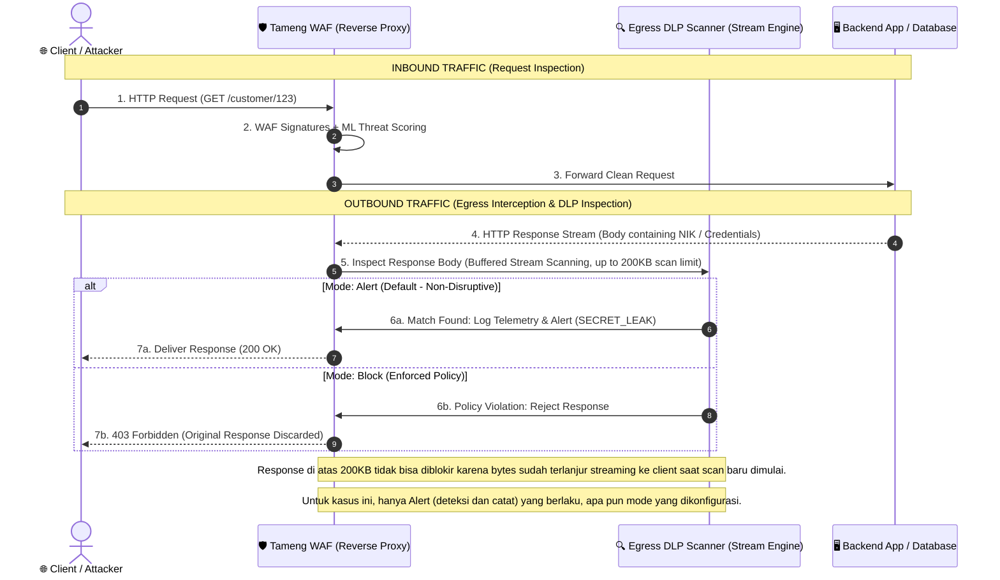
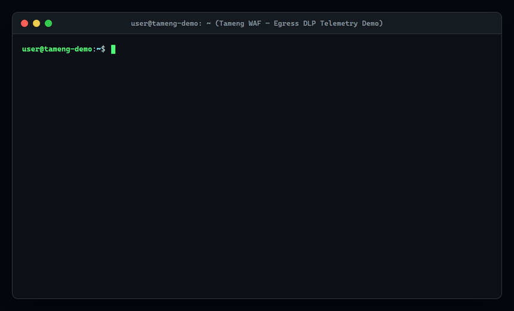
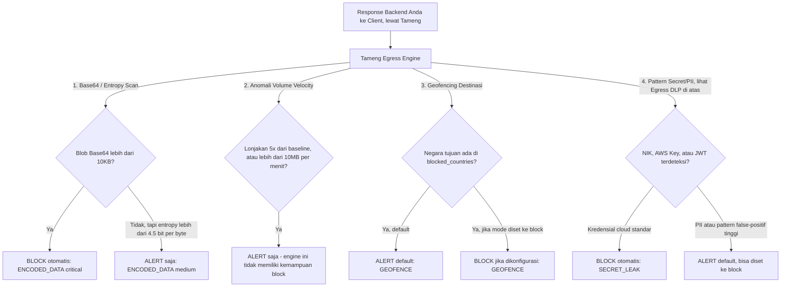
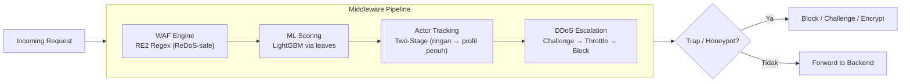
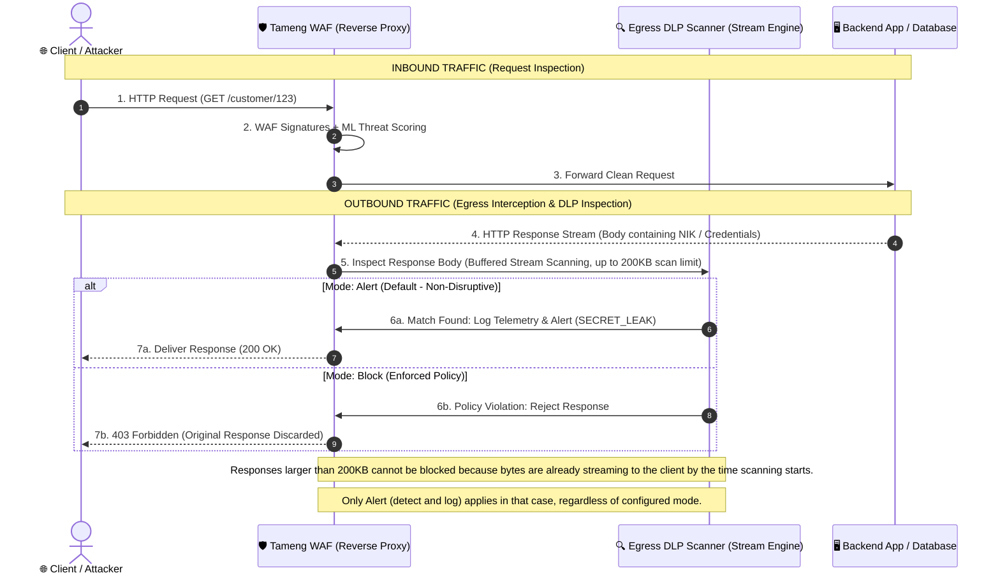
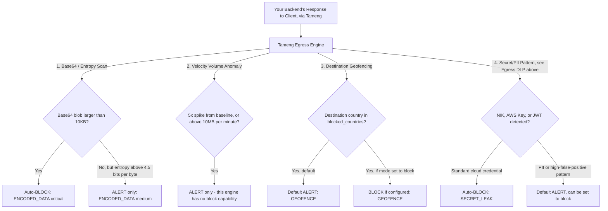
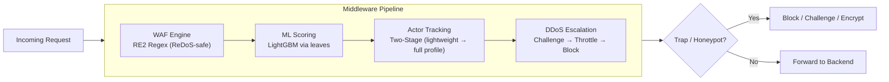

<p align="center">
  <a href="https://github.com/koodoxz/tameng/actions"></a>
  
  
  
  
</p>

<h1 align="center">🛡️ Tameng</h1>

<p align="center">
  <b>A single-binary, ML-assisted Web Application Firewall, written in Go.</b><br>
  <sub>No Python sidecar for real-time threat detection. No external inference service for WAF scoring. No 12-container stack. One binary, one YAML file, one systemd unit.</sub>
</p>

<p align="center">
  🇮🇩 Designed and built in Indonesia, by a solo security engineer, in the open.
</p>

<p align="center">
  
</p>

<p align="center">
  <a href="#bahasa-indonesia">Bahasa Indonesia</a> ·
  <a href="#english">English</a> ·
  <a href="#quick-start-en">Quick Start</a> ·
  <a href="CONTRIBUTING.md">Contributing</a> ·
  <a href="#license">License</a>
</p>

---

# Bahasa Indonesia

## Daftar Isi

- [Tentang Tameng](#tentang-tameng)
- [Kenapa Tameng Berbeda](#differensiator-teknis)
- [Fitur Keamanan Inti](#fitur-keamanan-inti)
- [Mulai Cepat](#mulai-cepat)
- [Konfigurasi](#konfigurasi)
- [Endpoint API](#endpoint-api)
- [Arsitektur](#arsitektur)
- [Testing](#testing)
- [Keamanan & Pelaporan Kerentanan](#keamanan--pelaporan-kerentanan)
- [Forecasting Opsional](#forecasting-opsional)
- [Roadmap](#roadmap)
- [Berkontribusi](#berkontribusi)
- [Tentang Pembuat](#tentang-pembuat)
- [Lisensi](#lisensi)

## Tentang Tameng 🛡️

**Perisai Web Application Firewall dengan Deteksi Ancaman Bertenaga ML**

Tameng adalah Web Application Firewall (WAF) berkinerja tinggi dengan deteksi ancaman berbasis machine learning, ditulis dalam Go untuk keamanan memori dan performa yang luar biasa.

Tameng menawarkan perlindungan lapisan aplikasi yang komprehensif melalui satu biner Go tunggal, satu file YAML, dan satu layanan systemd — tanpa ketergantungan sidecar eksternal.

### Kenapa "Tameng"?

**Tameng** adalah kata bahasa Indonesia untuk *perisai* — alat pelindung yang berdiri di depan, menahan serangan sebelum mencapai apa yang dilindunginya. Nama ini dipilih dengan sengaja: proyek ini dibangun oleh seorang developer Indonesia, dan harapannya sederhana — menjadi salah satu perisai nyata untuk infrastruktur digital, mulai dari yang dibangun sendiri, lalu siapa pun yang membutuhkannya. Bukan sekadar nama produk, tapi cita-cita: keamanan siber berkualitas yang lahir dan tumbuh dari Indonesia, dibuka untuk semua orang.

> [!NOTE]
> **Catatan Penamaan:** Nama internal (module Go, binary, komentar kode) tetap menggunakan "Svalinn" (nama penutup dalam mitologi Nordik yang melindungi matahari dari kehancuran) — kebetulan bertema sama: perisai. Ini adalah keputusan deliberate untuk menghindari refactoring invasif pada sistem produksi aktif. Dokumentasi publik dan branding menggunakan "Tameng".

## Differensiator Teknis

Dibandingkan dengan WAF open-source lainnya seperti **Coraza** (library WAF murni, kompatibel ModSecurity):

- **Baterai Lengkap:** Satu biner menggabungkan mesin WAF + penilaian ML + pelacakan aktor dua-tahap + eskalasi DDoS 3-fase + lapisan honeypot/deception + integrasi threat intelligence (STIX/TAXII) + pemetaan MITRE ATT&CK
- **Keamanan Regex:** Engine WAF menggunakan RE2 Go (bukan Oniguruma/PCRE) — ReDoS (regex backtracking bencana) mustahil secara struktural, bukan hanya mitigated
- **ML Asli:** Inferensi model berbasis LightGBM berjalan asli dalam Go (via library `leaves`) untuk threat scoring real-time per-request — tidak ada proses Python sidecar di jalur request. Tameng juga menyertakan fitur forecasting tren opsional berbasis Prophet (forecasting volume gray-zone/alert) yang memang membutuhkan runtime Python 3 lokal — ini subsistem terpisah dan opsional (nonaktif secara default), bukan bagian dari jalur WAF/scoring inti. Lihat [Forecasting Opsional](#forecasting-opsional)
- **Tracking Aktor:** Melacak aktor dalam dua tahap (lightweight counters → full profiles) dengan eviction LRU aman memori, bahkan di bawah beban korban DDoS
- **Transparansi Pengujian Adversarial:** Historik pengujian mendalam dengan alat pembuat serangan khusus (dibuat oleh penulis yang sama). Kami mempublikasikan eksperimen yang gagal juga — kebanyakan security tools tidak pernah mengumumkan ketika sebuah pendekatan tidak membantu.

### Adversarial Red-Teaming (Ratatoskr) ⚡

Tameng diuji secara internal menggunakan **Ratatoskr** — tool pembuat serangan/payload generator khusus (dibangun oleh penulis yang sama, belum dirilis publik) yang dirancang untuk menguji batas fungsionalitas WAF di bawah beban kerja ekstrem (*high-load*) dan skenario evasion nyata, bukan sekadar unit test sintetis.

| Metrik Pengujian | Hasil | Metodologi Red-Team |
| :--- | :---: | :--- |
| 🎯 **Evasion Payload Blocking** | **100% (13/13)** | Varian serangan terobfuskasi & teknik evasion nyata, lewat endpoint yang sama sepanjang engagement pengujian |
| 📥 **STIX/TAXII Payload Ingestion** | **100% (13/13)** | SQLi/XSS/traversal/command-injection via endpoint TAXII nyata & teregistrasi (unauthenticated by design) — endpoint yang sama yang sempat kena bug konfigurasi block-threshold, sekarang sudah diperbaiki dan diverifikasi ulang secara live |
| 🔐 **Integritas Endpoint Ecosystem** | **100% (4/4)** | Laporan HEIMDALL/DNS palsu ditolak oleh IP allowlist; feed baca tanpa autentikasi ditolak oleh middleware auth |
| 🧪 **Ketahanan Resource / Crash-Safety** | **0 Bypass, 0 Crash** | Probe body-size, nesting JSON, dan parameter limit yang dibatasi terhadap handler nyata; target tetap sehat sebelum dan sesudah |
| 🛡️ **ReDoS Fuzzing Stability** | **0 Crashes** | 8 juta+ eksekusi fuzzed payload di seluruh permukaan deteksi, pada Go RE2 regex engine |
| 🔧 **Perbaikan Produksi Nyata** | **16+ Fixes** | Termasuk kasus yang gagal di percobaan pertama, bukan cuma yang langsung berhasil |

> [!TIP]
> **Transparansi Radikal:** Seluruh klaim telemetry, memory limit, dan blocking rate dalam dokumentasi ini murni berasal dari simulasi red-team riil Ratatoskr — bukan angka microbenchmark buatan, dan termasuk mempublikasikan perbaikan dari percobaan pertama yang sempat gagal.

## Fitur Keamanan Inti

| Fitur | Deskripsi |
|-------|-----------|
| **Mesin WAF (200+ signature)** | SQL Injection, XSS, Path Traversal, Command Injection, SSRF, Log4Shell, Scanner/Bot detection |
| **Proteksi DDoS** | Deteksi EWMA + eskalasi 3-fase (Challenge → Throttle → Block) |
| **Pelacakan Aktor** | Dua-tahap dengan fingerprinting behavioral DNA, penyimpanan memory-safe, integrasi Reserse |
| **Deception Layer** | 100+ honeypot/canary traps untuk mengalihkan dan mengidentifikasi penyerang |
| **Fingerprinting** | JA3 TLS + HTTP behavior profiling |
| **Deteksi Kill Chain** | Korelasi serangan multi-tahap, deteksi Command & Control (C2) |
| **Threat Intelligence** | Integrasi STIX/TAXII, pemetaan MITRE ATT&CK, feed IOC |
| **Guard Protokol** | Deteksi request smuggling, GraphQL depth limiting, WebSocket rate limiting |
| **Analisis Behavioral** | Baseline deviation detection, credential stuffing identification, anomaly correlation |

### Egress Data Loss Prevention (DLP) 🔍

Tameng bertindak sebagai *Reverse Proxy* yang secara aktif mengintersepsi traffic *outbound* (response body stream) yang keluar dari backend menuju client untuk mencegah kebocoran data sensitif (seperti NIK, NPWP, BPJS, nomor HP Indonesia, JWT, dan API Key cloud) secara real-time.



#### Ringkasan Kapabilitas Intersepsi Egress DLP:

| Pilar Kapabilitas | Mekanisme Teknis | Dampak Operasional |
| :--- | :--- | :--- |
| 🔄 **Outbound Stream Interception** | Mengintersepsi *chunked response body* langsung dari aplikasi backend sebelum terkirim ke socket TCP client. | Tidak memerlukan perubahan kode aplikasi di backend sama sekali. |
| 🇮🇩 **Pola Deteksi PII Indonesia** | Pattern matching berbasis RE2 + entropy scanning untuk NIK (KTP), NPWP, BPJS, dan Nomor HP Indonesia. | Deteksi spesifik untuk kebutuhan kepatuhan regulasi data di Indonesia (UU PDP). |
| 🔑 **Deteksi Kredensial & Secrets** | Deteksi otomatis AWS/GCP API Keys, Private Keys (PEM), JWT tokens, dan DB connection strings. | Mencegah *accidental secret exposure* dari endpoint API debug/error log backend. |
| 🎛️ **Dual Interception Modes** | **Mode Alert (default, non-disruptive)**: deteksi + catat telemetry, traffic tidak terganggu.<br>**Mode Block**: `403 Forbidden` — seluruh response ditolak (bukan redaksi/masking). | Fleksibilitas deployment: amati *false-positive* dulu sebelum mengaktifkan penindakan aktif. |

<p align="center">
  
</p>

> [!NOTE]
> **Sensitivitas PII & Mode Detection:** Secara default, deteksi PII (seperti NIK dan nomor HP) berjalan dalam mode **Alert** (deteksi dan catat telemetry) sehingga operator dapat mengamati tingkat *false-positive* pada traffic produksi sebelum mengaktifkan mode **Block**.

> [!WARNING]
> **Batasan yang jujur kami sampaikan:** blokir reputasi-IP saat ini berdurasi tetap dan berlaku untuk seluruh IP sumber yang terdeteksi — pada jaringan dengan IP keluar bersama (NAT/proxy korporat/CDN), ini bisa berdampak ke pengguna lain di IP yang sama. Durasi dapat diatur lewat konfigurasi. Lihat [Keamanan & Pelaporan Kerentanan](#keamanan--pelaporan-kerentanan) kalau kamu menemukan dampak ini di deploymentmu.

### Deteksi Anti-Eksfiltrasi Egress (Non-DLP) 🕵️

Kebanyakan WAF di pasaran hanya fokus pada traffic *inbound*. Engine egress yang sama di atas (`internal/egress/advanced.go`) juga menjalankan tiga pemeriksaan tambahan terhadap setiap response yang lewat Tameng — relevan untuk skenario backend yang sudah disusupi (webshell, malware) dan mencoba mengirim data keluar lewat jalur HTTP normal.



| Pilar | Mekanisme Teknis | Perilaku Default |
| :--- | :--- | :--- |
| 📦 **Deteksi Payload Terenkode** | Blob Base64 >10KB di response body → **block otomatis** (severity critical). Body dengan Shannon entropy >4.5 bit/byte (>500 byte) → alert (medium), indikasi data terenkripsi/di-obfuscate. | Base64 besar: block. Entropy tinggi saja: alert. |
| 📈 **Anomali Volume (Velocity)** | Baseline dinamis per-user/IP; lonjakan ≥5× dari rata-rata historis, atau >10MB/menit, memicu alert. | **Alert saja — engine ini tidak memiliki kemampuan block sama sekali, di severity apa pun.** |
| 🌍 **Geofencing Destinasi** | Response menuju negara di `blocked_countries` (default: `RU, CN, KP, IR, BY, SY`) terdeteksi via GeoIP dari IP client sebenarnya, bukan Host header. | **Alert secara default** (`geofence_mode: alert`) — ubah ke `block` di config untuk penegakan aktif. |

> [!IMPORTANT]
> **Batasan cakupan yang jujur kami sampaikan:** ketiga pemeriksaan di atas (dan DLP sebelumnya) hanya menganalisis **response HTTP yang mengalir kembali melalui Tameng** ke client — baik dari handler Tameng sendiri maupun dari backend yang di-*reverse-proxy* di baliknya. Tameng adalah WAF Layer-7 di jalur request/response, **bukan** firewall level jaringan/host yang mengawasi seluruh traffic keluar server. Malware yang membuka koneksi outbound sendiri secara langsung (misal reverse shell yang connect keluar ke C2, atau C2 lewat DNS tunneling) **tidak terlihat oleh engine ini** — itu di luar jangkauan arsitektur reverse-proxy L7 mana pun, bukan keterbatasan khusus Tameng.

## Mulai Cepat

### Prasyarat

- **Go 1.26+** (build dari sumber)
- **Docker & Docker Compose** (Docker deployment) — tidak perlu Go installed
- **SQLite3** (embedded di binary Go, CGO diperlukan untuk build)

### Opsi 1: Docker (Direkomendasikan)

```bash
# Clone repo
git clone https://github.com/koodoxz/tameng.git
cd tameng

# Copy environment template
cp .env.example .env

# Edit .env dengan nilai Anda (SVALINN_GOD_KEY, SVALINN_API_KEY, dll)
nano .env

# Build dan jalankan
docker-compose up -d

# Periksa health
curl http://localhost:10000/health

# Lihat logs
docker-compose logs -f svalinn
```

**Port default:** `10000` (HTTP), `10443` (HTTPS)

### Opsi 2: Dari Sumber

```bash
# Prerequisites: Go 1.26+ dengan CGO enabled untuk sqlite3

git clone https://github.com/koodoxz/tameng.git
cd tameng
cp .env.example .env
nano .env

CGO_ENABLED=1 go build -o tameng ./cmd/svalinn
./tameng -config configs/svalinn.yaml
```

## Konfigurasi

Semua konfigurasi melalui **environment variables** dan file `configs/svalinn.yaml`. Lihat `.env.example` untuk daftar lengkap.

**Kunci Wajib:**
- `SVALINN_GOD_KEY` — Kunci autentikasi untuk `/api/v9/*` endpoints (admin saja)
- `SVALINN_API_KEY` — Kunci untuk akses programmatic (threat reporting, actor queries)
- `SVALINN_RESERSE_USER` / `SVALINN_RESERSE_PASS` — Kredensial modul tracking aktor lanjutan (Reserse). Server menolak untuk start jika kosong (fail-closed by design).

**Kunci Opsional (Ekosistem MECOB):**
- `ODIN_API_KEY` — Kunci integrasi opsional dengan layanan gateway/DNS internal ekosistem MECOB (belum rilis publik)

**Tuning Lanjutan:**
Threshold WAF/DDoS, batas jumlah aktor di memory, dan toggle fitur (ML scoring, deception, dll) dikonfigurasi langsung lewat `configs/svalinn.yaml` — bukan environment variable. Lihat file tersebut untuk daftar lengkap opsi (WAF, DDoS, ML, deception, SIEM, CVE feeds, TLS, dll).

### Menjalankan di Depan Aplikasi Anda (Reverse Proxy)

Sejak versi ini, Tameng bisa berdiri langsung di jalur trafik aplikasi Anda, bukan cuma sebagai layanan intelligence-as-a-service yang berdiri sendiri. Set `server.backend_url` di `configs/svalinn.yaml`:

```yaml
server:
  backend_url: "http://127.0.0.1:8080"  # aplikasi Anda
```

Request yang tidak cocok dengan rute Tameng sendiri (health, metrics, TAXII, API, dll) akan diteruskan ke `backend_url` **setelah** melewati seluruh middleware chain (WAF, DDoS, actor-tracking, deception) — bukan sebelumnya. Kosongkan (default) untuk menjalankan Tameng standalone seperti sebelumnya.

**Keterbatasan yang jujur kami sampaikan (implementasi awal ini):**
- Belum mendukung WebSocket upgrade atau streaming SSE/chunked ke backend (akan gagal/di-buffer) — belum cocok untuk backend berbasis WebSocket.
- Body request di atas 8 KiB ditolak (413) — belum ada streaming upload.
- Beberapa path administratif/decoy bawaan Tameng selalu menutupi backend Anda kalau aplikasi Anda memakai path yang sama — cek `configs/svalinn.yaml` dan source `internal/server/server.go` untuk daftar lengkapnya sebelum menentukan struktur routing aplikasi Anda.
- `X-Forwarded-Proto` yang diteruskan ke backend hanya benar kalau TLS langsung terminate di Tameng sendiri — kalau TLS di-terminate di nginx/reverse-proxy lain di depan Tameng, backend akan selalu melihat "http".
- Jangan arahkan `backend_url` ke Tameng sendiri (loop) atau ke alamat yang tidak Anda kendalikan.
- Sama seperti WAF secara umum, blokir reputasi-IP di depan backend Anda berdurasi tetap dan berlaku untuk seluruh IP sumber — pada jaringan dengan IP keluar bersama (NAT/proxy korporat/CDN), ini bisa berdampak ke pengguna lain di IP yang sama yang mencoba mengakses aplikasi Anda. Lihat catatan lengkap di [Fitur Keamanan Inti](#fitur-keamanan-inti).

## Endpoint API

| Endpoint | Metode | Deskripsi |
|----------|--------|-----------|
| `/health` | GET | Health check |
| `/metrics` | GET | Prometheus metrics |
| `/api/v1/stats` | GET | Server statistics |
| `/api/v1/threats` | GET | Recent threats |
| `/api/v1/actors` | GET | Active actors |
| `/api/v1/config` | GET | Current config |
| `/api/v9/reload` | POST | Reload config (God Mode) |
| `/api/v9/block` | POST | Block IP (God Mode) |
| `/reserse/actors` | GET | Reserse actor details (Basic Auth) |
| `/reserse/actors/{id}/timeline` | GET | Timeline event untuk satu profil aktor (Basic Auth) |
| `/reserse/actors/by-ip/{ip}/timeline` | GET | Timeline event berdasarkan IP (Basic Auth) |
| `/reserse/graph` | GET | Actor relationship graph (Basic Auth) |
| `/taxii` | GET | TAXII discovery document |
| `/taxii/collections` | GET | Daftar koleksi TAXII |
| `/taxii/collections/default/objects` | GET | Baca STIX indicator (public) |
| `/taxii/collections/default/objects` | POST | Submit STIX indicator (perlu `SVALINN_API_KEY`) |

## Arsitektur

```
internal/
├── actor/          # Two-stage actor tracking (lightweight → full profiles)
├── behavior/       # Behavioral baseline + deviation analysis
├── collector/      # Threat intelligence collectors
├── config/         # YAML config loader with env expansion
├── countermeasures/ # Active response mechanisms
├── db/             # SQLite persistence
├── ddos/           # EWMA + 3-phase escalation
├── deception/      # Honeypots + canary tokens
├── detect/         # Kill chain + C2 detection
├── ecosystem/      # MECOB ecosystem integration (internal gateway/DNS services)
├── egress/         # Egress filtering
├── fingerprint/    # JA3 + HTTP fingerprinting
├── geoip/          # MaxMind GeoIP lookups
├── hardening/      # Memory + security hardening
├── heuristics/     # Threat scoring heuristics
├── honeypot/       # Dedicated honeypot engine
├── intel/          # MITRE ATT&CK + IOC + STIX
├── logger/         # zerolog structured logging
├── logic/          # Business logic abuse detection
├── malware/        # Malware behavior analysis
├── ml/             # LightGBM ML bridge (native Go)
├── observatory/    # Top actors cache (Hall of Fame)
├── orchestrator/   # Detection orchestration
├── payload/        # YARA/Sigma/Snort signatures
├── preattack/      # Pre-attack detection (recon/scanning)
├── protocol/       # Request smuggling, GraphQL depth, WebSocket
├── response/       # Response encryption + PoW challenges
├── security/       # Security hardening utilities
├── semantic/       # Semantic payload analysis
├── server/         # HTTP/TLS server + middleware pipeline
├── session/        # Session tracking
├── siem/           # SIEM integration
└── waf/            # WAF signature engine (200+)
```



**Data Flow:** Request masuk → middleware pipeline → WAF signature check + ML scoring → actor tracking + behavioral analysis → DDoS detection → deception/honeypot checks → response shaping (encryption, PoW) → SIEM/intel logging → forward to backend (atau block/challenge).

## Testing

```bash
go test ./internal/...                                  # Unit tests
go test -race ./internal/...                             # Dengan race detector
go test -coverprofile=coverage.out ./internal/...        # Coverage
go tool cover -func=coverage.out
go test ./internal/waf/...                                # Specific package
go test -bench=. -benchmem ./internal/...                # Benchmarks
```

Lihat file `*_test.go` untuk differential fuzz tests, mutation tests, dan adversarial test cases.

## Keamanan & Pelaporan Kerentanan

Tameng menjalankan `/.well-known/security.txt` di setiap instance yang jalan (lihat `/security-policy` untuk kebijakan lengkap). Untuk melaporkan kerentanan atau perilaku tak terduga (termasuk dampak dari desain blokir-reputasi-IP di atas), hubungi **koodoxz@gmail.com**. Target respons awal: 24 jam. Triage: 72 jam.

Mohon jangan buka issue publik untuk kerentanan yang belum di-patch — laporkan lewat email dulu.

## Forecasting Opsional

Tameng menyertakan subsistem forecasting tren opsional (`internal/ml/prophet.go`, `anomaly.go`) yang shell-out ke proses Python 3 lokal untuk memprediksi tren volume gray-zone/alert. Fitur ini **nonaktif secara default** dan **tidak dibutuhkan** untuk perlindungan WAF, pencocokan signature, atau threat scoring LightGBM — ketiganya berjalan sepenuhnya di dalam satu biner Go tanpa proses eksternal apa pun.

Mengaktifkan forecasting membutuhkan instalasi Python 3 lokal dengan script di bawah `.harvest/scripts/` (berbasis Prophet) tersedia di host. Kalau kamu tidak butuh forecasting tren, kamu tetap mendapat pengalaman single-binary tanpa sidecar sepenuhnya, langsung dari awal.

## Roadmap

- [x] Publikasikan CI build terverifikasi penuh (GitHub Actions, cross-platform)
- [ ] Konfigurasi durasi blokir reputasi-IP per-kategori (bukan durasi tetap tunggal)
- [x] Dokumentasi deployment reverse-proxy (di depan backend generik)
- [ ] Ekspansi signature WAF untuk kategori LFI/RFI

Punya usulan lain? Buka [issue](.github/ISSUE_TEMPLATE/feature_request.md).

## Berkontribusi

Lihat [CONTRIBUTING.md](CONTRIBUTING.md) untuk panduan lengkap: proses issue/PR, gaya kode Go, running tests.

Secara singkat:
- Fork, branch, commit dengan pesan deskriptif
- Jalankan `go fmt`, `go vet`, `go test -race`
- Coverage minimal 80% untuk kode baru
- Jelaskan perubahan dengan jelas di PR, termasuk implikasi keamanan jika ada

## Tentang Pembuat

Tameng dikembangkan dan dirawat oleh satu orang developer/security engineer asal Indonesia, sebagai proyek open-source pertama yang dirilis ke publik. Dibangun, diuji secara adversarial, dan didokumentasikan secara transparan — termasuk kegagalan-kegagalannya. Kontak: **koodoxz@gmail.com**.

## Lisensi

**AGPL-3.0** — Kode sumber harus tersedia untuk semua pengguna dari versi yang dimodifikasi, **termasuk ketika dijalankan sebagai layanan jaringan** (ini yang membedakan AGPL dari GPL biasa). Provider hosting/cloud tidak dapat mengambil kode ini, memodifikasinya, dan menawarkannya sebagai layanan bersaing tanpa merilis modifikasi mereka. Teks lengkap: [LICENSE](LICENSE).

---

# English

## Table of Contents

- [About Tameng](#about-tameng)
- [Why Tameng Is Different](#technical-differentiation)
- [Core Security Features](#core-security-features)
- [Quick Start](#quick-start-en)
- [Configuration](#configuration)
- [API Endpoints](#api-endpoints)
- [Architecture](#architecture)
- [Testing](#testing-en)
- [Security & Vulnerability Reporting](#security--vulnerability-reporting)
- [Optional Forecasting](#optional-forecasting-en)
- [Roadmap](#roadmap-en)
- [Contributing](#contributing-en)
- [About the Author](#about-the-author)
- [License](#license)

## About Tameng 🛡️

**Web Application Firewall with ML-Powered Threat Detection**

Tameng is a high-performance Web Application Firewall (WAF) with machine learning-powered threat detection, written in Go for memory safety and exceptional performance.

Tameng delivers comprehensive application-layer protection through a single Go binary, one YAML file, and one systemd service — with no external sidecar dependencies.

### Why "Tameng"?

**Tameng** is the Indonesian word for *shield* — something that stands in front, absorbing an attack before it reaches whatever it protects. The name was chosen deliberately: this project is built by an Indonesian developer, and the hope behind it is simple — to be one real shield for digital infrastructure, starting with what its author builds, then for whoever else needs it. Not just a product name, but an intent: security tooling that's genuinely good, born and grown in Indonesia, and given away to everyone.

> [!NOTE]
> **Naming Note:** The internal codebase (Go module path, binary name, code comments) still uses the codename "Svalinn" (the shield in Norse mythology that protects the sun from destruction) — fittingly, the same theme. This is a deliberate choice to avoid invasive refactoring on a live production system. Public documentation and branding use "Tameng."

## Technical Differentiation

Compared to other open-source WAFs like **Coraza** (a pure WAF library, ModSecurity-compatible):

- **Batteries Included:** One binary combines WAF signature engine + ML threat scoring + two-stage actor tracking + 3-phase DDoS escalation (Challenge → Throttle → Block) + honeypot/deception layer + STIX/TAXII threat intelligence + MITRE ATT&CK mapping
- **Regex Safety:** WAF engine uses Go's RE2 regex engine (not Oniguruma/PCRE) — ReDoS (catastrophic backtracking) is structurally impossible, not just mitigated
- **Native ML:** LightGBM model inference runs natively in Go (via the `leaves` library) for real-time per-request threat scoring — no Python sidecar in the request path. Tameng also ships an optional Prophet-based trend-forecasting feature (gray-zone/alert volume forecasting) that does require a local Python 3 runtime — this is a separate, optional subsystem (disabled by default), not part of the core WAF/scoring path. See [Optional Forecasting](#optional-forecasting-en)
- **Actor Tracking:** Tracks threat actors in two stages (lightweight counters → full behavioral profiles) with memory-safe LRU eviction, even under DDoS victim load
- **Adversarial Testing Transparency:** Deep red-team history with a purpose-built companion attack tool. We publish failed optimization attempts too — most security tools never announce when an approach didn't help.

### Adversarial Red-Teaming (Ratatoskr) ⚡

Tameng is tested internally using **Ratatoskr** — a custom payload generator and attack simulation tool (built by the same author, not itself open source) designed to stress-test WAF functional boundaries under high load and real evasion scenarios, not just synthetic unit tests.

| Test Metric | Result | Red-Team Methodology |
| :--- | :---: | :--- |
| 🎯 **Evasion Payload Blocking** | **100% (13/13)** | Real-world obfuscated attack variants & evasion techniques, fired through the same endpoint used throughout this testing engagement |
| 📥 **STIX/TAXII Payload Ingestion** | **100% (13/13)** | SQLi/XSS/traversal/command-injection via the real, registered TAXII endpoint (unauthenticated by design) — the same endpoint previously affected by a block-threshold configuration bug, now fixed and reverified live |
| 🔐 **Ecosystem Endpoint Integrity** | **100% (4/4)** | Forged HEIMDALL/DNS reports rejected by the IP allowlist; unauthenticated read feeds rejected by auth middleware |
| 🧪 **Resource Exhaustion / Crash-Safety** | **0 Bypasses, 0 Crashes** | Bounded body-size, JSON-nesting, and limit-parameter probes against real handlers; target remained healthy before and after |
| 🛡️ **ReDoS Fuzzing Stability** | **0 Crashes** | 8M+ fuzzed payload executions across the full detection surface, on Go's RE2 regex engine |
| 🔧 **Real Production Fixes** | **16+ Fixes** | Including cases we got wrong on the first attempt, not just the ones that worked immediately |

> [!TIP]
> **Radical Transparency:** All telemetry, memory limits, and blocking rates claimed throughout this README come directly from real Ratatoskr red-team simulations — not synthetic microbenchmarks, including published iterations from initial failed passes.

## Core Security Features

| Feature | Description |
|---------|-------------|
| **WAF Signatures (200+)** | SQL Injection, XSS, Path Traversal, Command Injection, SSRF, Log4Shell, Scanner/Bot detection |
| **DDoS Protection** | EWMA rate detection + 3-phase escalation (Challenge → Throttle → Block) |
| **Actor Tracking** | Two-stage with behavioral DNA fingerprinting, memory-safe storage, Reserse integration |
| **Deception Layer** | 100+ honeypots and canary tokens for actor redirection and identification |
| **Fingerprinting** | JA3 TLS + HTTP behavior profiling |
| **Kill Chain Detection** | Multi-stage attack correlation, Command & Control (C2) detection |
| **Threat Intelligence** | STIX/TAXII integration, MITRE ATT&CK mapping, IOC feeds |
| **Protocol Guards** | Request smuggling detection, GraphQL depth limiting, WebSocket rate limiting |
| **Behavioral Analysis** | Baseline deviation detection, credential stuffing identification, anomaly correlation |

### Egress Data Loss Prevention (DLP) 🔍

Tameng operates as an inline *Reverse Proxy* that actively intercepts outbound response body streams leaving backend applications to detect and prevent sensitive data leaks (such as Indonesian NIK, NPWP, BPJS, phone numbers, JWTs, and cloud API keys) in real-time.



#### Egress DLP Interception Summary:

| Feature Pillar | Technical Mechanism | Operational Value |
| :--- | :--- | :--- |
| 🔄 **Outbound Stream Interception** | Intercepts chunked response bodies directly from backend applications before writing to client TCP sockets. | Zero backend application code modifications required. |
| 🇮🇩 **Indonesian PII Patterns** | RE2 pattern matching + entropy scanning for NIK (KTP), NPWP, BPJS, and Indonesian Phone Numbers. | Tailored compliance enforcement for Indonesian Data Protection (UU PDP). |
| 🔑 **Credentials & Secrets Detection** | Automated pattern matching for AWS/GCP API Keys, Private Keys (PEM), JWT tokens, and DB connection strings. | Prevents accidental secret exposure in backend debug/error log endpoints. |
| 🎛️ **Dual Interception Modes** | **Alert Mode (default, non-disruptive)**: detect + log telemetry, traffic unaffected.<br>**Block Mode**: `403 Forbidden` -- the entire response is rejected (no redaction/masking). | Deployment flexibility: monitor false-positive rates before enabling active blocking. |

<p align="center">
  
</p>

> [!NOTE]
> **PII Sensitivity & Detection Mode:** By default, PII detection operates in **Alert** mode (detect & log telemetry) allowing security operators to monitor production traffic patterns before promoting rules to **Block** mode.

> [!WARNING]
> **Honest limitation:** IP-reputation blocking currently uses a fixed duration applied to the entire source IP once triggered — on networks with shared egress IPs (NAT, corporate proxy, CDN), this can affect other users behind the same IP. Duration is configurable. See [Security & Vulnerability Reporting](#security--vulnerability-reporting) if you observe this impact in your deployment.

### Egress Anti-Exfiltration Detection (Beyond DLP) 🕵️

Most WAFs on the market focus almost entirely on inbound traffic. The same egress engine above (`internal/egress/advanced.go`) also runs three additional checks against every response passing through Tameng — relevant for a compromised-backend scenario (webshell, malware) attempting to move data out over normal HTTP.



| Pillar | Technical Mechanism | Default Behavior |
| :--- | :--- | :--- |
| 📦 **Encoded Payload Detection** | A Base64 blob >10KB in the response body → **auto-block** (critical severity). A body with Shannon entropy >4.5 bits/byte (>500 bytes) → alert (medium), indicating encrypted/obfuscated data. | Large Base64: block. High entropy alone: alert. |
| 📈 **Volume Anomaly (Velocity)** | Dynamic per-user/IP baseline; a spike ≥5× the historical average, or >10MB/minute, triggers an alert. | **Alert only — this engine has no block capability at all, at any severity.** |
| 🌍 **Destination Geofencing** | A response destined for a country in `blocked_countries` (default: `RU, CN, KP, IR, BY, SY`), resolved via GeoIP on the real client IP, not the Host header. | **Alert by default** (`geofence_mode: alert`) — set to `block` in config for active enforcement. |

> [!IMPORTANT]
> **Honest scope limitation:** the three checks above (and DLP before them) only analyze **HTTP responses that flow back through Tameng** to the client — whether from Tameng's own handlers or from a backend reverse-proxied behind it. Tameng is a Layer-7 WAF sitting in the request/response path, **not** a network- or host-level firewall monitoring all outbound traffic from the server. Malware that opens its own independent outbound connection (e.g. a reverse shell connecting directly out to a C2 server, or C2 over DNS tunneling) **is invisible to this engine** — that's outside the reach of any L7 reverse-proxy architecture, not a Tameng-specific gap.

## Quick Start (EN)

### Prerequisites

- **Go 1.26+** (to build from source)
- **Docker & Docker Compose** (Docker deployment) — Go not required
- **SQLite3** (embedded in Go binary; CGO required for building)

### Option 1: Docker (Recommended)

```bash
git clone https://github.com/koodoxz/tameng.git
cd tameng

cp .env.example .env
nano .env   # SVALINN_GOD_KEY, SVALINN_API_KEY, etc.

docker-compose up -d
curl http://localhost:10000/health
docker-compose logs -f svalinn
```

**Default ports:** `10000` (HTTP), `10443` (HTTPS)

### Option 2: From Source

```bash
# Prerequisites: Go 1.26+ with CGO enabled for sqlite3

git clone https://github.com/koodoxz/tameng.git
cd tameng
cp .env.example .env
nano .env

CGO_ENABLED=1 go build -o tameng ./cmd/svalinn
./tameng -config configs/svalinn.yaml
```

## Configuration

All configuration is via **environment variables** and the `configs/svalinn.yaml` file. See `.env.example` for the complete list.

**Required Keys:**
- `SVALINN_GOD_KEY` — Authentication key for `/api/v9/*` endpoints (admin only)
- `SVALINN_API_KEY` — Key for programmatic access (threat reporting, actor queries)
- `SVALINN_RESERSE_USER` / `SVALINN_RESERSE_PASS` — Credentials for the advanced actor-tracking module (Reserse). The server refuses to start if these are empty (fail-closed by design).

**Optional Keys (MECOB Ecosystem):**
- `ODIN_API_KEY` — Optional integration key for an internal MECOB ecosystem gateway/DNS service (not yet publicly released)

**Advanced Tuning:**
WAF/DDoS thresholds, actor memory limits, and feature toggles (ML scoring, deception, etc.) are configured directly in `configs/svalinn.yaml` — not via environment variables. See that file for the full list of options (WAF, DDoS, ML, deception, SIEM, CVE feeds, TLS, etc.).

### Running In Front Of Your Application (Reverse Proxy)

As of this version, Tameng can sit directly in your application's traffic path, not just run as a standalone intelligence-as-a-service. Set `server.backend_url` in `configs/svalinn.yaml`:

```yaml
server:
  backend_url: "http://127.0.0.1:8080"  # your application
```

Any request that doesn't match one of Tameng's own routes (health, metrics, TAXII, API, etc.) is forwarded to `backend_url` **after** passing through the full middleware chain (WAF, DDoS, actor-tracking, deception) — never before it. Leave empty (default) to run Tameng standalone, as before.

**Honest limitations of this initial implementation:**
- No WebSocket upgrade or SSE/chunked streaming support to the backend yet (fails or buffers) — not yet suitable for WebSocket-based backends.
- Request bodies over 8 KiB are rejected (413) — no streaming uploads yet.
- Several built-in administrative/decoy paths Tameng already owns always shadow your backend if your app uses the same paths — check `configs/svalinn.yaml` and the `internal/server/server.go` source for the full list before finalizing your app's routing.
- The `X-Forwarded-Proto` header forwarded to the backend is only accurate when TLS terminates directly at Tameng — if TLS terminates at an upstream nginx/reverse-proxy in front of Tameng instead, the backend will always see "http".
- Don't point `backend_url` at Tameng's own listener (creates a loop) or at an address you don't control.
- Same as WAF blocking in general, IP-reputation blocking in front of your backend uses a fixed duration applied to the entire source IP — on networks with shared egress IPs (NAT, corporate proxy, CDN), this can affect other users behind the same IP trying to reach your application. See the full note in [Core Security Features](#core-security-features).

## API Endpoints

| Endpoint | Method | Description |
|----------|--------|-------------|
| `/health` | GET | Health check |
| `/metrics` | GET | Prometheus metrics |
| `/api/v1/stats` | GET | Server statistics |
| `/api/v1/threats` | GET | Recent threats |
| `/api/v1/actors` | GET | Active actors |
| `/api/v1/config` | GET | Current config |
| `/api/v9/reload` | POST | Reload config (God Mode) |
| `/api/v9/block` | POST | Block IP (God Mode) |
| `/reserse/actors` | GET | Reserse actor details (Basic Auth) |
| `/reserse/actors/{id}/timeline` | GET | Timeline events for a single actor profile (Basic Auth) |
| `/reserse/actors/by-ip/{ip}/timeline` | GET | Timeline events by IP (Basic Auth) |
| `/reserse/graph` | GET | Actor relationship graph (Basic Auth) |
| `/taxii` | GET | TAXII discovery document |
| `/taxii/collections` | GET | List TAXII collections |
| `/taxii/collections/default/objects` | GET | Read STIX indicators (public) |
| `/taxii/collections/default/objects` | POST | Submit a STIX indicator (requires `SVALINN_API_KEY`) |

## Architecture

```
internal/
├── actor/          # Two-stage actor tracking (lightweight → full profiles)
├── behavior/       # Behavioral baseline + deviation analysis
├── collector/      # Threat intelligence collectors
├── config/         # YAML config loader with env expansion
├── countermeasures/ # Active response mechanisms
├── db/             # SQLite persistence
├── ddos/           # EWMA + 3-phase escalation
├── deception/      # Honeypots + canary tokens
├── detect/         # Kill chain + C2 detection
├── ecosystem/      # MECOB ecosystem integration (internal gateway/DNS services)
├── egress/         # Egress filtering
├── fingerprint/    # JA3 + HTTP fingerprinting
├── geoip/          # MaxMind GeoIP lookups
├── hardening/      # Memory + security hardening
├── heuristics/     # Threat scoring heuristics
├── honeypot/       # Dedicated honeypot engine
├── intel/          # MITRE ATT&CK + IOC + STIX
├── logger/         # zerolog structured logging
├── logic/          # Business logic abuse detection
├── malware/        # Malware behavior analysis
├── ml/             # LightGBM ML bridge (native Go)
├── observatory/    # Top actors cache (Hall of Fame)
├── orchestrator/   # Detection orchestration
├── payload/        # YARA/Sigma/Snort signatures
├── preattack/      # Pre-attack detection (recon/scanning)
├── protocol/       # Request smuggling, GraphQL depth, WebSocket
├── response/       # Response encryption + PoW challenges
├── security/       # Security hardening utilities
├── semantic/       # Semantic payload analysis
├── server/         # HTTP/TLS server + middleware pipeline
├── session/        # Session tracking
├── siem/           # SIEM integration
└── waf/            # WAF signature engine (200+)
```



**Data Flow:** Incoming request → middleware pipeline → WAF signature check + ML scoring → actor tracking + behavioral analysis → DDoS detection → deception/honeypot checks → response shaping (encryption, PoW) → SIEM/intel logging → forward to backend (or block/challenge).

## Testing (EN)

```bash
go test ./internal/...                                  # Unit tests
go test -race ./internal/...                             # With race detector
go test -coverprofile=coverage.out ./internal/...        # Coverage
go tool cover -func=coverage.out
go test ./internal/waf/...                                # Specific package
go test -bench=. -benchmem ./internal/...                # Benchmarks
```

See `*_test.go` files for differential fuzz tests, mutation tests, and adversarial test cases.

## Security & Vulnerability Reporting

Every running Tameng instance serves `/.well-known/security.txt` (see `/security-policy` for the full policy). To report a vulnerability or unexpected behavior (including impact from the IP-reputation blocking design noted above), contact **koodoxz@gmail.com**. Initial response target: 24 hours. Triage: 72 hours.

Please do not open a public issue for unpatched vulnerabilities — email first.

## Optional Forecasting (EN)

Tameng includes an optional trend-forecasting subsystem (`internal/ml/prophet.go`, `anomaly.go`) that shells out to a local Python 3 process for gray-zone/alert-volume trend prediction. This is **disabled by default** and is **not required** for WAF protection, signature matching, or LightGBM threat scoring — all three run entirely inside the single Go binary with no external process.

Enabling forecasting requires a local Python 3 installation with the scripts under `.harvest/scripts/` (Prophet-based) available on the host. If you don't need trend forecasting, you get the full single-binary, no-sidecar experience out of the box.

## Roadmap (EN)

- [x] Fully verified CI build (GitHub Actions, cross-platform)
- [ ] Per-category configurable IP-reputation block duration (not a single fixed duration)
- [x] Reverse-proxy deployment documentation (in front of a generic backend)
- [ ] WAF signature expansion for LFI/RFI categories

Have another idea? Open a [feature request](.github/ISSUE_TEMPLATE/feature_request.md).

## Contributing (EN)

See [CONTRIBUTING.md](CONTRIBUTING.md) for full guidelines: issue/PR process, Go code style, running tests.

In short:
- Fork, branch, commit with descriptive messages
- Run `go fmt`, `go vet`, `go test -race`
- Minimum 80% coverage for new code
- Describe changes clearly in PR, including security implications if any

## About the Author

Tameng is built and maintained by a solo Indonesian developer/security engineer, as their first project released to the public as open source. Built, adversarially tested, and documented transparently — failures included. Contact: **koodoxz@gmail.com**.

## License

**AGPL-3.0** — Source code must be available to all users of any modified version, **including when run as a network service** (this is what distinguishes AGPL from plain GPL). A cloud/hosting provider cannot take this code, modify it, and offer it as a competing service without releasing their modifications. Full text: [LICENSE](LICENSE).

<p align="center">
  <sub>🇮🇩 Made in Indonesia.</sub>
</p>
